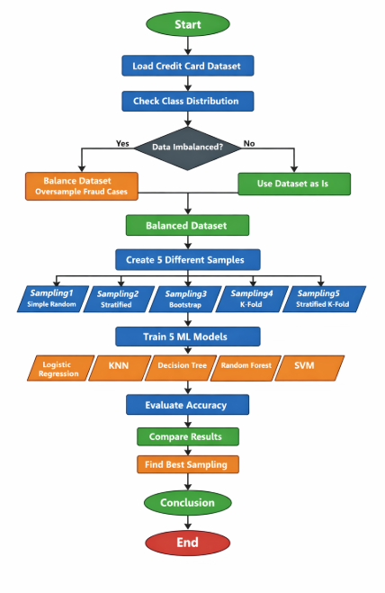

# 📘 Sampling Assignment – Credit Card Fraud Detection  

---

##  Overview

This project studies how different **sampling techniques** impact the performance of
machine learning models on a **highly imbalanced credit card fraud dataset**.

The main objectives are to handle class imbalance, apply multiple sampling techniques,
and compare model performance to identify the most effective approach.

---

##  Workflow

---

##  Data Balancing

The dataset was originally imbalanced, with very few fraud cases.
To address this, the minority class was **oversampled with replacement** until both
classes had equal representation. This step helps ensure that models learn patterns
from both normal and fraudulent transactions fairly.

---

##  Sampling Techniques

| Code | Technique |
|-----|----------|
| Sampling1 | Simple Random Sampling |
| Sampling2 | Stratified Sampling |
| Sampling3 | Bootstrap Sampling |
| Sampling4 | K-Fold Sampling |
| Sampling5 | Stratified K-Fold Sampling |

---

##  Machine Learning Models

Logistic Regression, KNN, Decision Tree, Random Forest, and SVM were used to evaluate
the effect of different sampling strategies.

---

##  Key Results

| Model | Best Sampling | Accuracy |
|------|--------------|----------|
| Logistic Regression | Sampling4 | 97.47% |
| KNN | Sampling1 | 96.86% |
| Decision Tree | Sampling1 | 97.94% |
| Random Forest | Sampling1 | 97.65% |
| SVM | Sampling1 | 96.55% |

---

##  Best Sampling Technique

- **Sampling1 (Simple Random Sampling)** performed best for most models.  
- **Sampling4 (K-Fold Sampling)** worked best for Logistic Regression.

---

##  Conclusion

This experiment shows that handling data imbalance is the most important step before
applying any sampling technique. Once the data is balanced, simple approaches like
**Simple Random Sampling** can perform just as well, or even better, than more complex
methods for many machine learning models.

However, not all models behave the same way. Logistic Regression, which is a linear
model, benefited from a more structured sampling approach such as **K-Fold Sampling**.
This highlights an important lesson: the choice of sampling technique should depend on
both the dataset and the type of model being used, rather than relying on a single
method for all cases.

---
